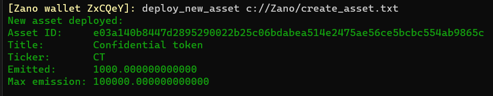

# Overview

Confidential Assets are privacy tokens with all the features of native Zano coin

:::info
Currently asset creation is only supported on Zano Testnet and will be brought to mainnet with upcoming Zarcanum hardfork
:::

Confidential Assets Commands are availabe trough CLI interface (simplewallet)

### Asset Methods

Full list of supported commands available in the Methods section. Assets can be created, minted, burned, whitelisted and updated (only metadata)

### Asset Creation Example

To deploy a new asset on the Zano blockchain, you need to prepare a JSON-formatted file with asset parameters. Here’s an example:

```
{
  "ticker": "CT",
  "full_name": "Confidential token",
  "total_max_supply": 100000000000000000,
  "current_supply": 1000000000000000,
  "decimal_point": 12,
  "meta_info": ""
}
```

Then run the following command specifying the route to the file:

```
deploy_new_asset <asset specs file location>
```

You should see a confirmation message upon successful execution


