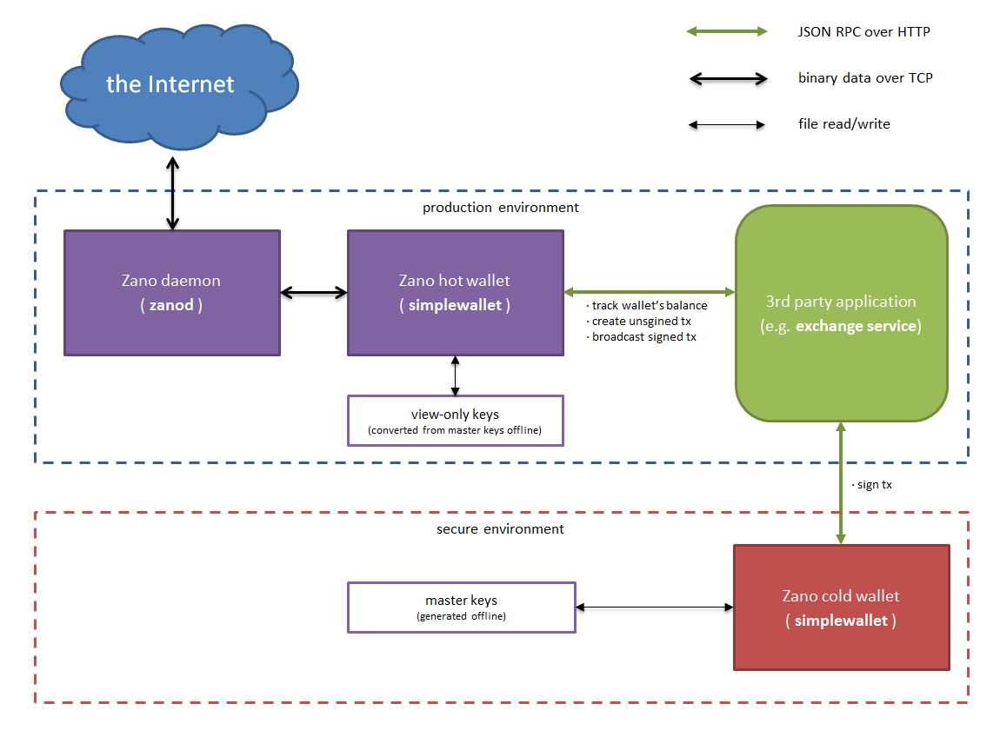

# Signing transactions offline (cold-signing process)

### Introduction

In order to provide more security it's possible to sign transactions offline using a dedicated wallet application instance e.g. running in a secure environment.



Zano as a CryptoNote coin uses two key pairs (4 keys) per wallet: view key (secret+public) and spend key (secret+public)

So-called "hot wallet" (or watch-only wallet) uses only view secret key. This allows it to distinguish its transactions among others in the blockchain. To spend coins a wallet needs to spend secret key. It is required to sign a tx. Watch-only wallet doesn't have access to spend secret key and thus it can't spend coins.

If someone has your spend secret key, he can spend your coins. Master keys should be handled with care.

### Setup

1. In a secure environment create a new master wallet:

    i. Start simplewallet to generate master wallet:
    `simplewallet --generate-new-wallet=zano_wallet_master`(zano_wallet_master is wallet's filename and can be changed freely)<br/>
    ii. Type in a password when asked. An empty new wallet is created.<br/>
    iii. Open new wallet one again: `simplewallet --offline-mode --wallet-file=zano_wallet_master`<br/>
    iv. Type the following command into wallet's console: `save_watch_only zano_wallet_watch_only WATCH_PASSWORD` where WATCH_PASSWORD is the password for a watch-only wallet. You should see: `Watch-only wallet has been stored to zano_wallet_watch_only`<br/>
    v. Type `exit` to quit simplewallet.<br/>

2. Copy zano_wallet_watch_only file from the secure environment to your production environment where daemons and the hot wallet is supposed to be run.

:::caution NOTE: zano_wallet_master file contains master wallet private keys! You may want it to never leave secure environment.
:::

3. In the production environment start the daemon. Let it sync with the network if running for the first time and make sure it gets synchronized. Then, start the watch-only wallet: `simplewallet --wallet-file=zano_wallet_watch_only --password=WATCH_PASSWORD --rpc-bind-ip=RPC_IP --rpc-bind-port=RPC_PORT --daemon-address=DEAMON_ADDR:DAEMON_PORT --log-file=LOG_FILE_NAME` (see also the Introduction; for the first run you may add `--log-level=0`  to avoid too verbose messages, for subsequent runs you may want to use `--log-level=1` or `--log-level=2`)

The setup is complete.

### Example of a transaction cold-signing

In order to sign a transaction, follow these steps:

4. Create a transaction using RPC [transfer](https://docs.zano.org/reference#transfer-2).

Because of using watch-only wallet keys for this instance of wallet application (please note passing **zano_wallet_watch_only** in i.3) a transaction will not be signed and broadcasted. Instead, an unsigned transaction will be prepared and returned back to the caller via RPC.

RPC example (please, see also [transfer](https://docs.zano.org/reference#transfer-2) RPC description in ["List of RPC calls"](https://docs.zano.org/reference/using-the-zano-api-guide#getbalance2) section above):

```shell 
$ curl http://127.0.0.1:12233/json_rpc -s -H 'content-type:application/json;' --data-binary '{"jsonrpc":"2.0","id":"0","method":"transfer", "params":{   "destinations":[{"amount":1000000000000, "address":"ZxCb5oL6RTEffiH9gj7w3SYUeQ5s53yUBFGoyGChaqpQdud2uNUaA936Q2ngcEouvmgA48WMZQyv41R2ASstyYHo2Kzeoh7GA"}], "fee":10000000000, "mixin":0, "unlock_time":0   }}'
```

```json
{
  "id": "0",
  "jsonrpc": "2.0",
  "result": {
    "tx_hash": "",
    "tx_size": 0,
    "tx_unsigned_hex": "00-LONG-HEX-00"
  }
}
```

Unsigned transaction data retrieved in `tx_unsigned_hex` field should be passed to a secure environment for cold-signing by the master wallet.

5. Run master wallet in RPC mode within a secure environment: `simplewallet --wallet-file=zano_wallet_master --offline-mode --rpc-bind-port=RPC_PORT --rpc-bind-ip=RPC_IP`

6. Using RPC [sing_transfer](https://docs.zano.org/reference/using-the-zano-api-guide#sign_transfer) sing the transaction using the master wallet.

RPC example:

```shell 
$ curl http://127.0.0.1:12233/json_rpc -s -H 'content-type:application/json;' --data-binary '{"jsonrpc":"2.0","id":"0","method":"sign_transfer", "params":{  "tx_unsigned_hex" : "00-LONG-HEX-00" }'
```

```json
{
  "id": "0",
  "jsonrpc": "2.0",
  "result": {
    "tx_hash": "864dc39fe1f1440651a9c2cc0585ba2f91498778bae86583d37fcc0b251aea4a",
    "tx_signed_hex": "00-LONG-HEX-00"
  }
}
```

A signed transaction retrieved in `tx_signed_hex` field should be passed back to the production environment to be broadcasted by the watch-only hot wallet.

7. Using RPC [submit_transfer](https://docs.zano.org/reference/using-the-zano-api-guide#submit_transfer) broadcast the transaction using watch-only wallet.

RPC example:

```shell
$ curl http://127.0.0.1:12233/json_rpc -s -H 'content-type:application/json;' --data-binary '{"jsonrpc":"2.0","id":"0","method":"submit_transfer", "params":{ "tx_signed_hex": "00-LONG-HASH-00"  }'
```

```json
{
  "id": "0",
  "jsonrpc": "2.0",
  "result": {
    "tx_hash": "864dc39fe1f1440651a9c2cc0585ba2f91498778bae86583d37fcc0b251aea4a"
  }
}
```

The transaction is successfully broadcasted over the network.

### Important note on watch-only wallets

Watch-only wallet is not able naturally to calculate a balance using only a tracking view secret key and an access to the blockchain. This happens because it can't distinguish spending its own coins as it requires knowing key images for own coins, which are unknown, as key image calculation requires spend secret key.

To workaround this difficulty watch-only wallet extracts and stores key images for own coins each time a signed transaction from a cold wallet is broadcasted using [submit_transfer](https://docs.zano.org/reference/using-the-zano-api-guide#submit_transfer) RPC. This data is stored locally and it is required to calculate wallet's balance in case of full wallet resync.

It's important to keep this data safe and not to delete watch-only wallet's files. Otherwise, watch-only wallet won't be able to calculate a balance correctly and cold wallet may be required to be connected online for recovering funds.