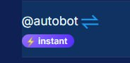

# Ping activity checker

> *You should call this method every 10 seconds to keep the `instant` icon active, so users know that your bot will accept the order immediately.*

> 

- **METHOD**: <kbd>POST</kbd>  
- **PATH**: `/api/dex/renew-bot`

#### Request:
```typescript
{
   token: string;
   orderId: number;
}
```

#### Response:
```typescript
   sucess: boolean;
   data?: string // error message
```