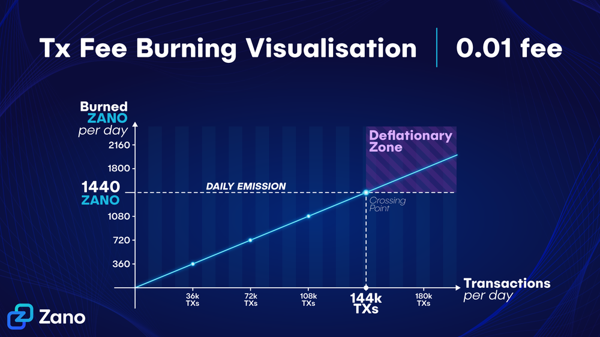

# Emission

### Where does the emission come from?

Zano has a hybrid PoW/PoS consensus algorithm to secure the network and therefore emission is generated from two distinct sources:

Proof of Work (PoW) mining, which creates new ZANO coins to reward miners for completing the calculations and therefore contributing to the network.

Proof of Stake (PoS) staking, which also creates new ZANO coins to reward users who stake their funds and therefore also contributing to the network's security.

100% of the block reward goes to the miner or staker that found the block.

| Emission specifications​ |                                               |
| ------------------------ | --------------------------------------------- |
| Block Time               | 1 minute                                      |
| Block Reward             | 1 ZANO (fixed amount)                         |
| Maximum Supply           | Uncapped                                      |
| Yearly Inflation         | Ever decreasing trend towards 0% (asymptotic) |
| Fee on TXs (flat fee)    | 0.01 ZANO                                     |
| Fee burn                 | 100% (all fees are burned)                    |

### Emission motivation

Zano decided to set the block reward relatively low to avoid unnecessary selling price pressure while keeping the chain safe from flood attacks. We have an uncapped max supply because the assumption that only the TX fees would be enough to cover miners' appetite might not be accurate and Bitcoin might become a sad example of this. A fixed emission ensures that stakers and miners will always secure the network.

On Zano, all network fees are being burned. With enough network usage, the daily fee burning could surpass the emission from block rewards, resulting in supply becoming deflationary over time.

This combination of small, minimalistic daily emission, together with daily burns, results in little to no sell pressure on the exchanges.

### Is the block reward enough to secure the network?

Zano has a unique consensus system in which in order to perform the classic 51% attack, you need to have at least 51% PoW hashrate AND 51% PoS power (there can also be other ratios like 20%/90% and so on (see the [whitepaper](https://github.com/hyle-team/docs/blob/master/zano/Zano_WP_1.1.pdf)).

This way an attack becomes very expensive, in particular because the purchase of a significant portion of the coins on the market would dramatically increase the price. If you try to use a small percentage of PoS coins for the attack, then the PoW power necessary for the attack becomes 800% or more. This makes it possible to establish a relatively low block reward and at the same time provide a high security level for the transaction history.

### Premine

Being actively involved in the crypto space since 2014, the Zano team is well aware of the financial struggles that projects face in development, especially during the first years where the community is small and thus crowdfunding is hardly an option.

Our decision to do a premine allowed us to keep our core team full-time since launch focused on Zano, even during harsh crypto-winters.

The premine consisted of 3.6M ZANO, it was set aside for marketing, partnerships, ongoing project expenses, as well as to pay a loan to fund initial development back in 2018.

As of June 2024, considering what has already been spent for development, our foundation fund sits at **just \~6%** of the total ZANO supply.

You can track the amount of the foundation fund via our [explorer](https://explorer.zano.org/) or by importing its tracking seed into your wallet:

`aZxat4HAWriVQ3enkGcVsrZRdMseAJswG3CSEwTqZS246VsFQ53w26eZstYsu1jWE74Atz9ajLxFnBsVTafncWNH5SMv4zHFaTS:1780c4d5dd7e97cc4a75ea8baa7977d12ef948b9a6dddc2a9a37e5e22ac7180e:1599495055`
