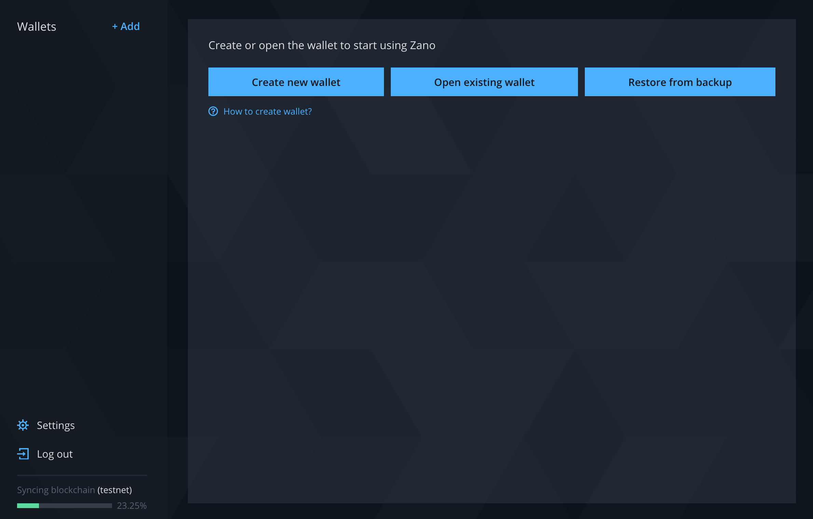

# Getting started

Those few steps will make you more familiar with Zano features and capabilities.

### Download and install Zano app

Zano app is available for Windows, Linux and MacOS. It can be downloaded here.

### Open Zano app

First you need to create a master password. It will let you manage your Zano wallets inside the app. Note that each wallet account will have separate password as well. Hit `Next` when ready.

### Create new wallet

Once app is open it will start syncing with the blockchain. While in progress some features such as sending transactions and contracts will be locked. Meanwhile you can still create your first Zano wallet by clicking `Create new wallet` .

Enter wallet name and password, then click `Select wallet location`. Note that both can be changed later in wallet details menu.

When wallet file is created you can continue with `Create wallet`. This file can be used to quickly import or restore closed wallets in Zano app.

To finalise wallet creation store wallet's seed phrase. IMPORTANT: using the seed phrase anyone can restore and take full control of the wallet. Keep it in a secured location and avoid unauthorized access to it by any means. Note that you can review the seed phrase later in wallet details menu.

Now the wallet has been created. You can copy wallet address and use it to receive ZANO from exchanges, mining pools and other sources.