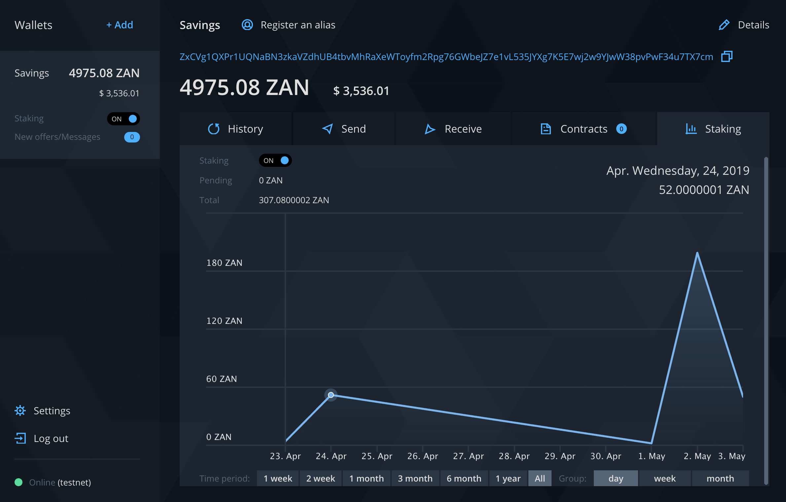

# Proof-of-stake mining

Proof-of-stake mining or POS for short is typically implemented such that a random coin owner obtains the right to sign a new block. Zano POS implementation keeps miners in full anonymity and is as simple as a push of a button, literally.

Open Zano app, make sure the blockchain is synchronised and turn on `Staking` switch.

*<figcaption style={{textAlign: "center" }} >Proof-of-stake mining</figcaption>*

You can observe your progress in the `Staking` tab of your staking wallet. The amount of earnings depends on the wallet balance. Note that funds, that participate in proof-of-stake will be locked. When you turn `Staking` off, balance will get unlocked right away. You can switch `Staking` on and off without any limitations.

### Server mode POS mining

Sometimes it may be convenient to do PoS mining without the GUI application running. Here are steps to achieve it.

1. Download Zano daemon (zanod executable) and simplewallet or build them following the [instructions](https://github.com/hyle-team/zano/blob/master/README.md).
2. Navigate to the Zano folder.
3. Start zanod daemon (service).
4. Start simplewallet in RPC mode with PoS mining enabled:

```
./simplewallet --wallet-file=PATH_TO_WALLET_FILE --rpc-bind-port=RPC_PORT_NUMBER --do-pos-mining --password=PASSWORD --log-level=LOG_LEVEL --log-file=PATH_TO_LOG --deaf --pos-mining-reward-address=REWARD_ADDR
```

Some of the parameters are required, and some are optional. Here's what they mean:

- `--wallet-file=PATH_TO_WALLET_FILE` (required) — sets the path to the wallet file where your coins are;
- `--rpc-bind-port=RPC_PORT_NUMBER` (required) — sets the TCP listening port number of the simplewallet RPC server and switches simplewallet into RPC mode. You can use any free TCP port number you want from 0 to 65535, like 55555. If this option is not used, simplewallet will start in normal CLI mode and PoS mining won't be available;
- `--do-pos-mining` (required) — starts PoS mining;
- `--password=PASSWORD` (optional) — password to your wallet. You may use it instead of entering the password interactively on start. **Please, take precautions** while using this parameter. Anyone who can get a processes list of your system with corresponding command lines can see your password. **Use it ONLY if you are absolutely sure you need it!** Please also note, that if your password contains special characters, it may be necessary to escape them when passing as an argument;
- `--log-level=LOG_LEVEL` (optional) — sets the log level, possible values are from 0 (less verbose) to 4 (extremely verbose). May be useful for debugging. Default is 0;
- `--log-file=PATH_TO_LOG` (optional) — sets path to the log file. Default is 'simplewallet.log' in the same folder where simplewallet binary is located;
- `--deaf` (optional) — turns on so called 'deaf mode'. simplewallet's RPC server will reject any requests with error 500. This is useful if you just want to mine PoS and don't want that anyone would be able to do RPCs on your wallet. **Highly recommend**. Default: off;
- `--pos-mining-reward-address=REWARD_ADDR` (optional) — sets an explicit address for receiving mining rewards. By default, all rewards will be received by the same wallet where staking coins are, so its balance will be gradually increasing. If you use this option, staking coins will be kept in the main wallet (specified by--wallet-file parameter), and mining rewards will be sent to the specified REWARD_ADDR. In such a case, the balance of the main wallet won't be changing due to the mining process.

Here's a real-world example of the command using recommended options (**don't forget to tailor it to your needs**):

```
../zano/build/src/simplewallet --wallet-file=zw3b --rpc-bind-port=50005 --do-pos-mining --log-level=0 --log-file=/home/user/zano/wallets/zw3b.log
--deaf --pos-mining-reward-address=aZxat4HAWriVQ3enkGcVsrZRdMseAJswG3CSEwTqZS246VsFQ53w26eZstYsu1jWE74Atz9ajLxFnBsVTafncWNH5SMv4zHFaTS
```