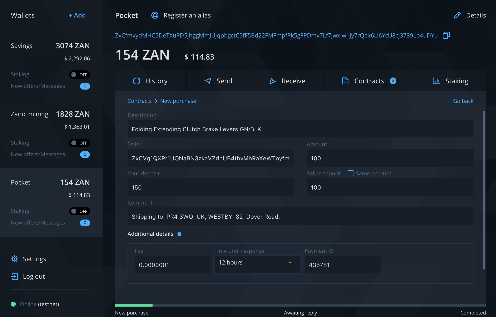
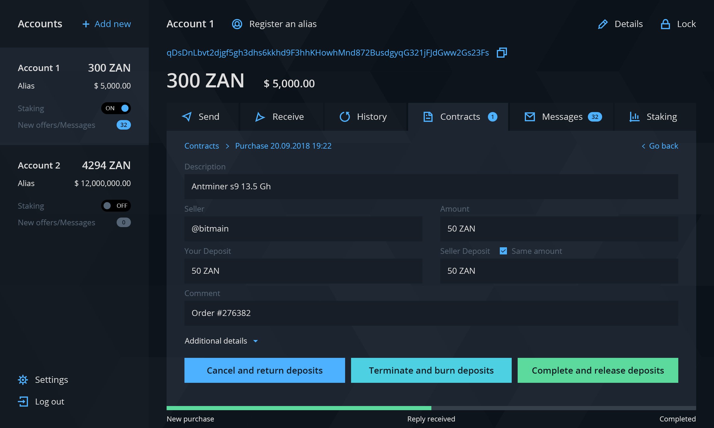

# Escrow contracts

Zano provides the framework for a secure and private transaction without the need for a trusted third party. Our Escrow system, as proposed, will require participants to make additional deposits, which they will forfeit if there is any attempt to act maliciously, or in a way that is contemptuous toward their counter party. For more information please refer to the "Escrow" section of the [whitepaper](https://docs.zano.org/docs/whitepaper).

### Propsal

Each escrow contract starts with the buyer proposal. Once it's sent the deposit amount will be locked for a `Time until response` period. If during the period seller accepts the terms, Escrow contract will be activated. To initiate the process navigate to wallet `Contracts` tab and choose `New Purchase`. Proposal details are the following.

- Description - title or description for contract subject
- Seller - wallet address of merchant or seller
- Amount - payment amount for goods or services
- Your deposit - sum of collateral and payment amount
- Seller deposit - collateral from seller required by buyer
- Comment - additional information like order ID, delivery address, etc.
- Fee - transaction fee amount
- Time until response - proposal expiration time
- Payment ID - transaction payment identifier provided by seller

*<figcaption style={{textAlign: "center" }} >Contract proposal</figcaption>*

### Confirmation

When the seller accepts the proposal a special multi signature transaction will be sent to the blockchain. Then after 10 confirmations a new contract will be started. The seller can now fulfil contract terms like shipping the item to the buyer.

*<figcaption style={{textAlign: "center" }} >Contract response</figcaption>*

The buyers contract window will get three options to continue with: `Cancel and return deposits`, `Terminate and burn deposits` and `Complete and release deposits`.

### Cancel and return deposits

The buyer can send a cancellation offer to return both deposits and close the contract. The seller can accept or ignore this offer within a given response time. This option is useful when deal is mutually canceled.

### Terminate and burn deposits

When parties cannot find mutual agreement on any occasions one can decide to burn the deposits completely and close the contract. In that case deposits will not be returned ever.

### Complete and release deposits

If buyer is satisfied with the delivery or a provided service the contract can be closed. Releasing deposits will return both parties collaterals.

*<figcaption style={{textAlign: "center" }} >Contract confirmation</figcaption>*