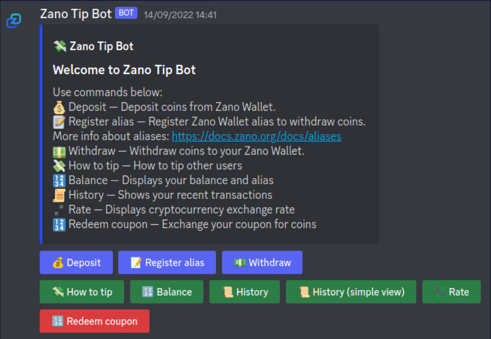
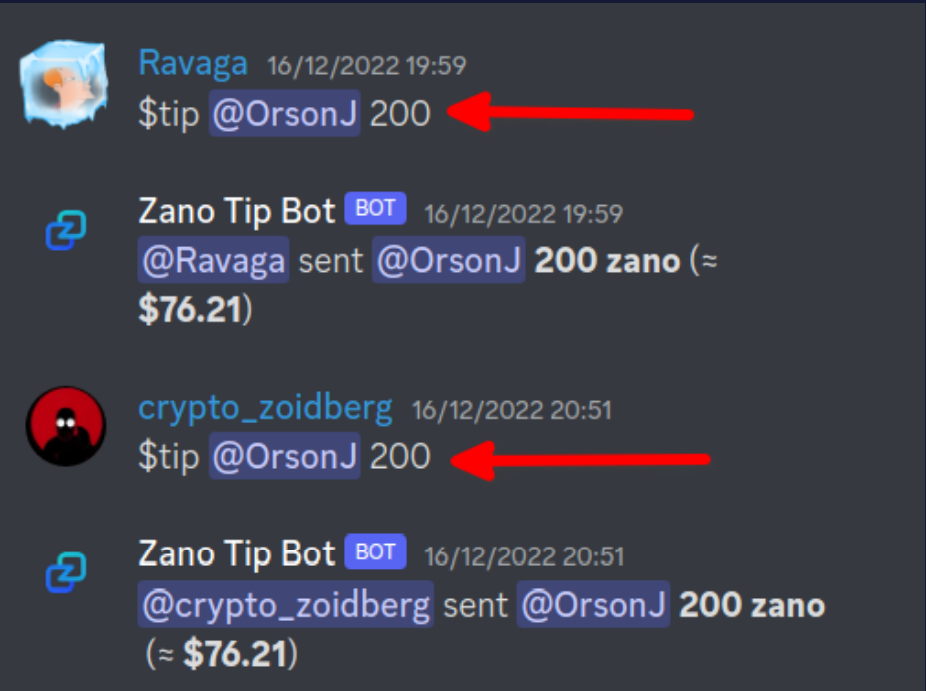
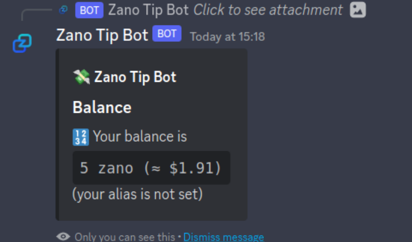
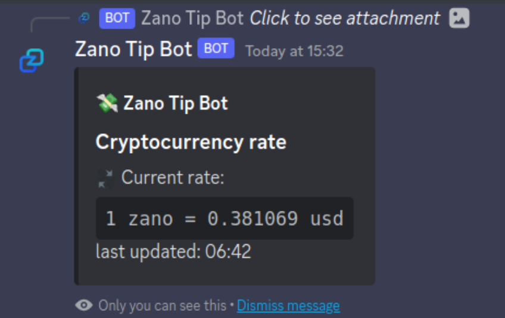
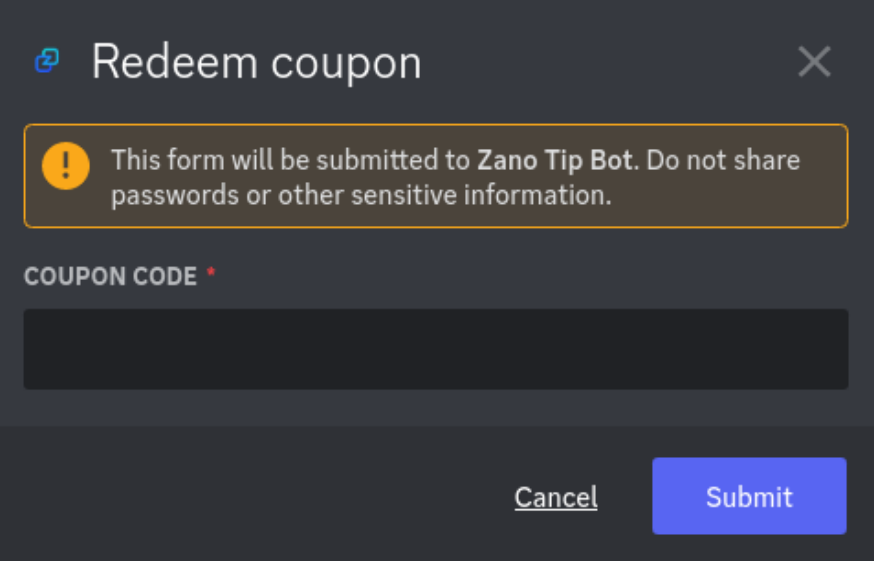

# Tip Bot Guide

A simple guide on how to get tipping Zano on Discord

Using Zano’s Discord TipBot is fairly straightforward and intuitive, but here we’ll give an overview of its usage to help you get started, quickly.

#### Get Discord

In order to use the Discord TipBot, we must first have Discord installed, head over to their website (or your package manager) and get signed up!  [https://discord.com/download/](https://discord.com/download/)

#### Join Zano’s Discord Channel

Now that we have Discord, head over to our discord channel and join the rest of the community! Simply click the link below.  [https://discord.gg/wE3rmYY](https://discord.gg/wE3rmYY)

### The Tip Bot

Welcome to Zano Discord, now that you’re here, you should have something that looks like the below image:

#### Head to TipBot Settings

Head to the ‘Bounties’ category and select the ‘tip-bot-settings’ channel, here lies a summary of the tip bots usage.

### Get tipping!

Let's take a look at the tip bots functionality, the below image shows what we can do with the bot.

#### Deposit

Before we can begin tipping, we must have some Zano in our tip bot wallet, to do this click on ‘Deposit’, get your wallet address and send some Zano to it.

#### Register alias

Before you can withdraw Zano others have tipped you, you must register an alias, more on aliases can be found here: [https://docs.zano.org/docs/aliases](https://docs.zano.org/docs/aliases)

Click ‘register alias’ and enter your alias.

#### How to tip

Tipping users is done with one simple command, to see this command, click ‘how to tip’

Simply replace and with the values you want to use, a real world example within discord looks something like this

#### Balance

To view how much Zano you have, simply click balance, and the tip bot will show how much Zano is in your wallet.

#### History & simple view

There are 2 history buttons, one designated History, and the other History (simple view).

History is formatted as a table, whereas History (simple) is a simple one-liner.

#### Rate

If you want to know the current price of Zano, click ‘Rate’, to see the current price in $USD.

#### Redeem coupon

If you have a coupon code, the ‘Redeem Coupon’ button allows you to exchange your coupon for Zano coins. Simply click the button and enter your coupon code.

