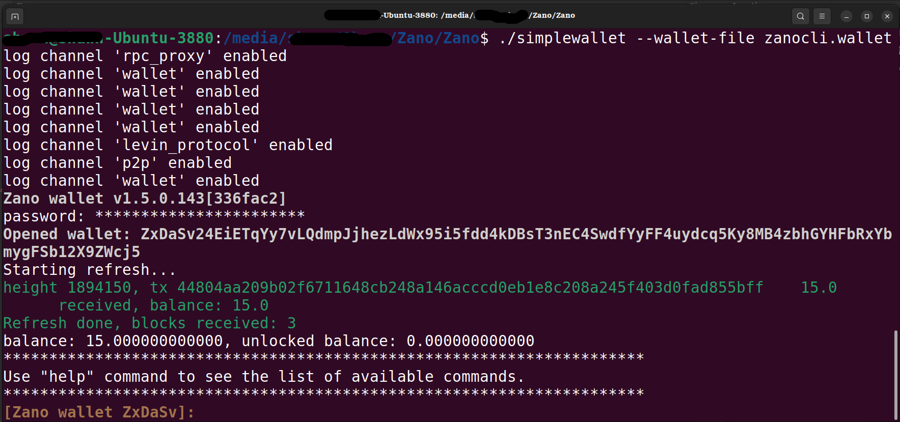
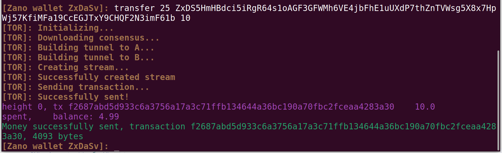
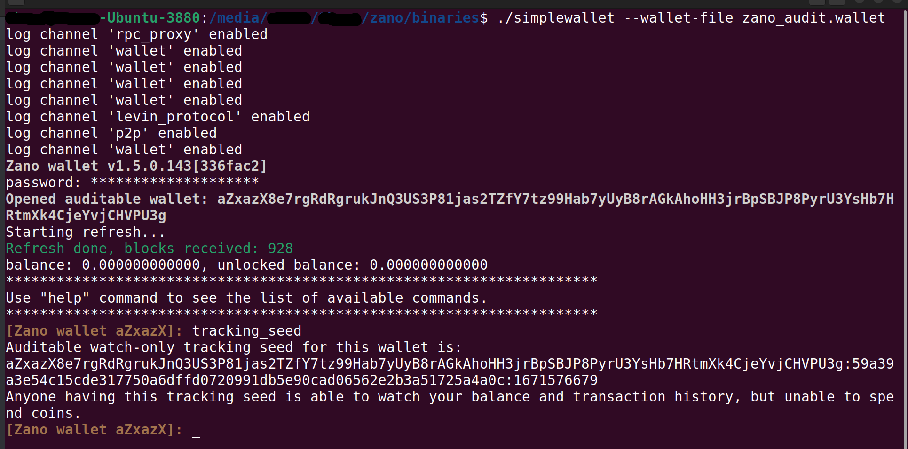
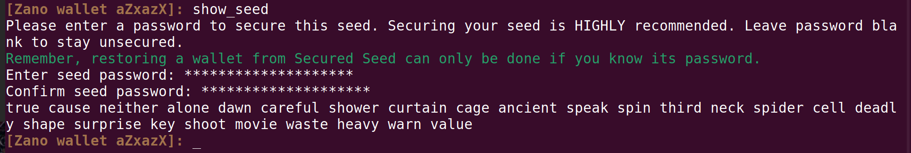
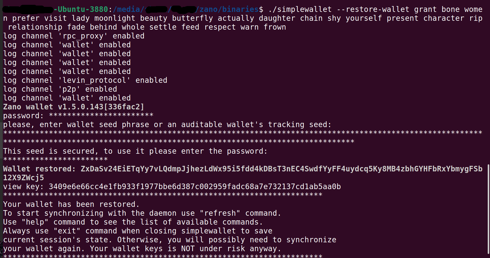

# Using a Zano CLI Wallet (Ubuntu)

Open a terminal in the directory with Zanod. Start your node, by giving the command:

```
./zanod
```

Open another terminal in the same directory (with simplewallet). Start your wallet, by giving the following command, substituting the name of your wallet:

```
./simplewallet --wallet-file name.wallet
```

Enter your password, when prompted. Notice that the wallet displays your receive address after “Opened wallet.” You will use this to fund your new wallet.



You are now ready to get yourself some ZANO! Two exchanges to consider:

Trade Ogre: https://tradeogre.com <br/>
Stex: https://www.stex.com/

P.S. Zanod (your node) can be left running, if you’ll be transferring funds to your wallet soon. If not, close your wallet by giving the command:

```
exit
```

After you’ve funded your new Zano CLI wallet, open it again and check for your funds (steps 1-2 above). If they’re not visible, wait a bit and then give the command:

```
refresh
```

Now let’s send some ZANO to a friend!

The command for sending ZANO consists of four important bits of information:

1. the command itself
2. the number of UTXOs with which to mix yours (between 10-50/maximum available)
3. the receiving address
4. the amount of ZANO you wish to send


<br/>
For example:<br/>
(1) (2) (3) (4)




### Creating an Auditable CLI Wallet

Owing to the inherent privacy of Zano wallets, no third parties can see their content on the blockchain, as with other cryptocurrencies with transparent ledgers.

There are instances, however, in which a user may want, or even need, the balance and transaction history of a wallet to be visible to a third-party (e.g., a public foundation). In such a case, one can use an Zano auditable CLI wallet (the auditable wallets are currently only available as CLI).

For further information on the auditable wallet, see https://docs.zano.org/docs/auditable-wallets

Give the following command, substituting "name":

```
./simplewallet --generate-new-auditable-wallet name.wallet
```

When prompted, enter your new password, preferably generated from a password generator.


You now have an auditable CLI. Anyone to whom you provide the tracking seed will be able to see the wallet's balance and transaction history.

If you ever need to retrieve the tracking seed, simply open the wallet and give the following command:

```
tracking_seed
```



Now, we must get our seed phrase, in case we ever need to restore our auditable CLI wallet. Within the wallet, give the command:

```
show_seed
```

Again, when prompted, supply and confirm another password, specific to the seed itself.



Lastly, note that the address of an auditable wallet always begins with an initial "a", in contrast to a standard wallet, which always begins with "Zx":

```
aZxazX8e7rgRdRgrukJnQ3US3P81jas2TZfY7tz99Hab7yUyB8rAGkAhoHH3jrBpSBJP8PyrU3YsHb7HRtmXk4CjeYvjCHVPU3g
```

### Restoring a CLI Wallet from Seed

For whatever reason, you may lose your original Zano CLI wallet (your name.wallet file) or its password. All is not lost, if you safeguarded your seed.

After starting zanod, open another terminal in the simple-wallet directory. Give the following command, supplying your seed phrase:

```
./simplewallet --restore-wallet your 24 word seedphrase
```

You will then be asked to reenter the seedphrase, enter the password specific to that seedphrase, and then enter your restored wallet's password.



### Creating a Watch-Only CLI Wallet

If you wish to allow someone to merely view your wallet, without being able to spend from it, you'll create a watch-only wallet. Open the wallet for which you wish to generate a watch-only wallet. Within the console, give the command, substituting the name of, and new password for, your new watch-only wallet:

```
save_watch_only new_name.wallet password_for_wallet
```


### Other Useful in-Terminal Flags

To skip supplying your password when opening wallet

```
--password arg
```

Use daemon instance at : for changing default host and port

```
--daemon-address arg
```

Prevents connecting to Zanod (daemon) for working offline (e.g., for cold-signing)

```
--offline-mode
```

Disables Tor from running with your wallet; this may be necessary if the Tor network itself is down.

```
--disable-tor-relay
```

Restores wallet from seed

```
--restore-wallet
```

Provides the destination for the log file, relative to the simplewalletbinary

```
--log-file arg
```

Sets the level of detail for the log

```
--log-level arg
```

Sets the level of detail for the log (same effect as above)

```
--set-log arg
```

Generates a new wallet that is auditable by a third party

```
--generate-new-auditable-wallet
```

And finally, to run any of the following commands outside of the wallet:

```
--command arg
```

**Other Useful in-Wallet Commands**

address = Shows current wallet public address

balance = Shows current wallet balance

exit = Closes the wallet

export_history [filename needed?] = Exports tx history into a CSV file

export_recent_transfers = Writes recent transfer txs in json to wallet_recent_transfers.txt (in Zano directory)

help = Shows a list of flags and commands

list_recent_transfers = Shows recent maximum 1000 sent amounts, offset default = 0, count default = 100

refresh = Resynchronize transactions and balance

resync = Resets all transfers and re-synchronize the wallet

save = Saves wallet synchronized data

show_seed = Displays secret 24 word phrase used to recover wallet

sweep_below <mixin_count>

<amount_lower_limit> [payment_id]: Tries to transfer all coins with amount below the given limit to the given address