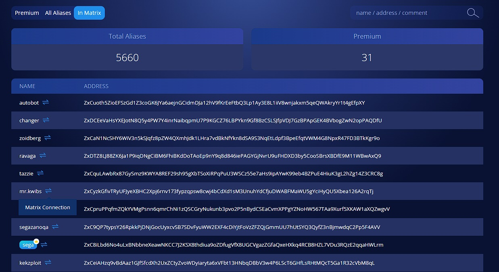

# Zano Matrix Guide

Zano Matrix enables secure, private messaging.

<Heading id="what-is-matrix" level="3">
  What is Matrix?
</Heading>

Matrix is a communication protocol for decentralized messaging, voice, and video calls. It operates across a federated network, which allows users to host their own servers while staying connected to each other. Matrix is open-source and connects multiple platforms to allow seamless interaction between them. You can compare it to e-mail; someone who uses Gmail can still send emails to someone who uses Yahoo.

<Heading id="what-is-zano-matrix" level="3">
  What is Zano Matrix?
</Heading>

With an increase in compromised communication platforms like Telegram and WhatsApp, we decided to integrate Zano with Matrix to have our own decentralized messenger server that authenticates via Zano aliases! Zano Matrix is a secure open-source messenger that authenticates via aliases in the Zano decentralized network. In addition, our private and encrypted server runs on our own hardware, ensuring that all messages are fully encrypted. By registering with your Zano alias, you can claim a unique username, ensuring your online identity is verified while maintaining your privacy and your messages are safe!

<Heading id="why-use-zano-matrix" level="3">
  Why use Zano Matrix?
</Heading>

- Decentralized: No single point of control or failure—users can host their own servers.

- Privacy and Security: End-to-end encryption ensures secure and private conversations.

- Data Ownership: Users retain full control of their data, especially when hosting their own server.

- Open-Source: Transparent and customizable code, enabling anyone to adapt and use it in their own way.

- Verification: You can be sure that you are talking to the owner of a certain alias, which is handy when doing business on one of the dApps in the Zano ecosystem.

You can start using the Zano Matrix Messenger here: [https://messenger.zano.org/](https://messenger.zano.org/)

<Heading id="how-to-get-started" level="3">
  How to get started
</Heading>

  <iframe
    src="https://www.youtube.com/embed/UycIuP5_EII?si=cvi4l6YkzjL2I6q4"
    title="YouTube video player"
    style={{ 
     position: 'absolute', 
     top: 0, 
     left: 0, 
     width: '100%', 
     height: '100%' 
    }}
    frameBorder="0"
    allow="accelerometer; autoplay; clipboard-write; encrypted-media; gyroscope; picture-in-picture; web-share"
    allowFullScreen
  />

1. Like all Zano dApps, Zano Matrix requires using Zano Companion; [click here](https://docs.zano.org/docs/use/companion) if you haven't set it up already.

2. Once your Companion is ready (make sure your desktop wallet is open and unlocked), head to [https://messenger.zano.org/](https://messenger.zano.org/) and click "Connect Wallet."

3. Once connected, create a password and username.

4. Download a Matrix client (like [Element](https://element.io/download)); all clients can be found on [Matrix's website](https://matrix.org/ecosystem/clients/).

5. &#x20;After opening the app, make sure to change the server from "[matrix.org](https://messenger.zano.org/)" to "[zano.org](https://messenger.zano.org/)."

6. Use your Zano Alias as username and the password you just created to log in and get access to the Matrix server.

7. Start messaging!

Furthermore, it's possible to connect with people via the Zano Explorer.

Simply click on the Matrix connection icon to be forwarded to a one-on-one chat using the Zano Matrix Messenger!

