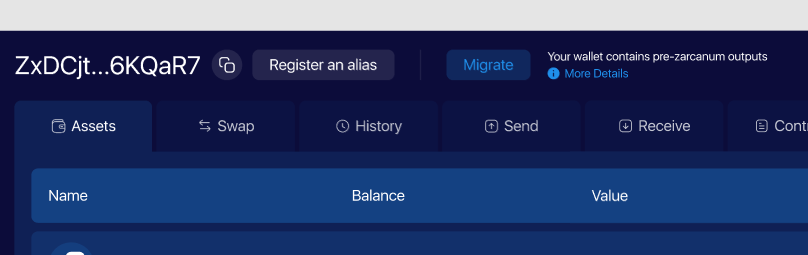
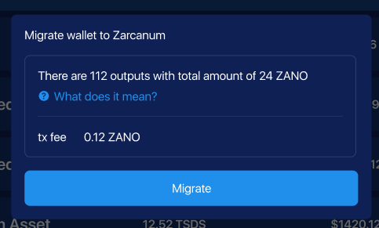

# Zarcanum Migration

With the Zarcanum hardfork, Zano introduces an essential feature for all users: the Auto Migration process. This feature is designed to seamlessly transition your wallet to the post-Zarcanum era, ensuring that you can continue to stake and participate in the network without interruption.

## What is Auto Migration?

Auto Migration is an automated process within the Zano wallet that takes pre-Zarcanum outputs and consolidates them. Here's what it entails:

**Collection**: The wallet automatically gathers all old outputs in your Zano wallet that were created before the Zarcanum hardfork.

**Consolidation**: These outputs are then consolidated into a few transactions. This step is crucial because it reduces the complexity and size of your wallet, making it more
efficient.

**Recreation**: The consolidated funds are sent to your own wallet address. This step recreates the outputs in the post-Zarcanum format, making your funds compatible with the new network rules.

**Staking Eligibility**: By converting your outputs to the new format, your wallet becomes eligible for staking in the post-Zarcanum era. This means you can immediately participate in securing the network and earning staking rewards.

## How to Use Auto Migration

Using the Auto Migration feature is simple, thanks to the new wallet interface. Follow these steps to ensure your wallet is ready for staking in the post-Zarcanum era:

**Look for the Migration Button**: When you open your updated Zano wallet, look for the 'Migrate wallet to Zarcanum' button, typically located at the top of the screen.

<figcaption style={{textAlign: "center" }} >Migration button</figcaption>

**Initiate Migration**: If your wallet detects pre-Zarcanum outputs, a popup will appear informing you of the number of outputs and the total ZANO amount they represent. For example, "There are 112 outputs with a total amount of 24 ZANO".

**Understand the Details**: If you're unsure about what 'outputs' means, click on the "What does it mean?" link for a detailed explanation — this will be the article currently in progress.

**Review the Transaction Fee**: The popup will also display the transaction fee required to migrate your outputs. Ensure you have enough balance to cover this fee.

**Confirm Migration**: By clicking the 'Migrate' button, the wallet will consolidate your outputs and recreate them in the post-Zarcanum format.

<figcaption style={{textAlign: "center" }} >Migration popup</figcaption>

**Complete the Process**: The migration transaction will be sent. It require 10 blocks time to get confirmed, just like any other transaction.

**Post-Migration**: Once the migration is completed, your wallet will be up-to-date with the Zarcanum protocol, and you'll be all set to continue staking and using your wallet as usual.
